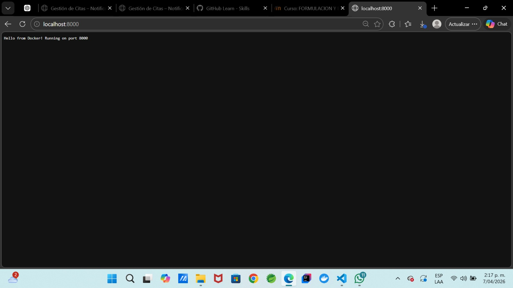
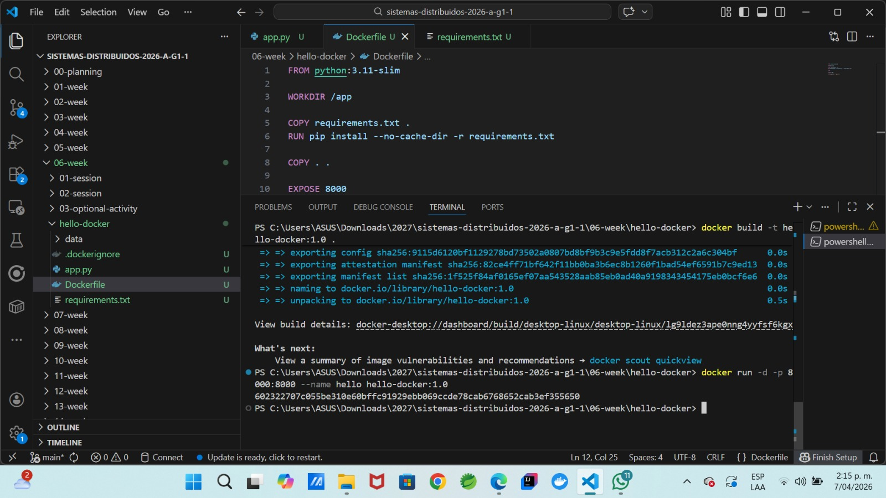
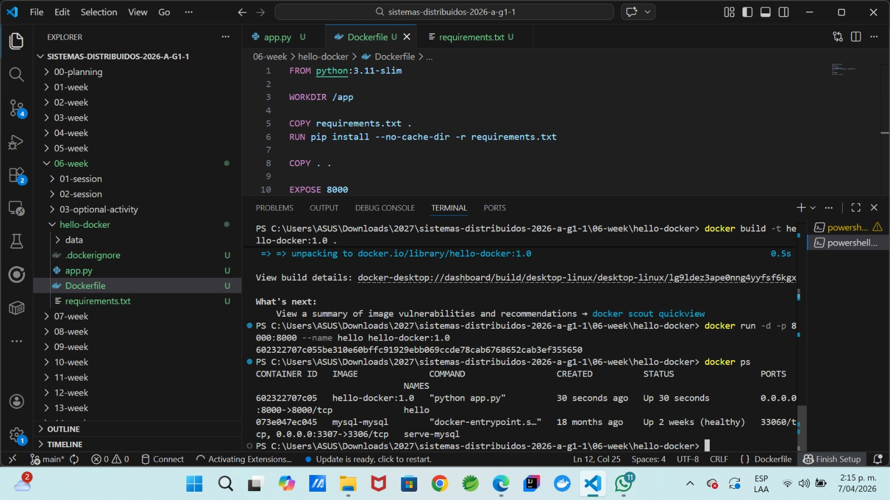

# Week 6 — Actividad práctica: Contenerización con Docker

## Estudiante

Nombre: Dayana Sofia Mendes
Curso: Sistemas Distribuidos
Semana: Week 6
Tema: Contenerización con Docker

---

# 1. Objetivo de la actividad

Construir una imagen Docker funcional para una aplicación mínima en Python y ejecutarla utilizando mapeo de puertos, variables de entorno y persistencia básica mediante volúmenes.

---

# 2. Descripción de la actividad

En esta actividad se desarrolló una aplicación mínima en Python que funciona como un servidor HTTP simple. Posteriormente, se creó una imagen Docker utilizando un Dockerfile, se ejecutó un contenedor a partir de dicha imagen y se verificó su funcionamiento mediante comandos de Docker y acceso desde el navegador.

---

# 3. Estructura del proyecto

La estructura del proyecto creada fue la siguiente:

```
06-week/
└── hello-docker/
    ├── app.py
    ├── requirements.txt
    ├── Dockerfile
    ├── .dockerignore
    └── data/
```

---

# 4. Código de la aplicación (app.py)

```python
from http.server import BaseHTTPRequestHandler, HTTPServer
import os

PORT = int(os.getenv("PORT", "8000"))
MESSAGE = os.getenv("MESSAGE", "Hello from Docker!")

class Handler(BaseHTTPRequestHandler):
    def do_GET(self):
        self.send_response(200)
        self.send_header("Content-type", "text/plain; charset=utf-8")
        self.end_headers()
        msg = f"{MESSAGE} Running on port {PORT}\n"
        self.wfile.write(msg.encode("utf-8"))

HTTPServer(("", PORT), Handler).serve_forever()
```

---

# 5. Archivo requirements.txt

```txt
requests==2.32.3
```

Este archivo define las dependencias necesarias para la aplicación.

---

# 6. Archivo .dockerignore

```txt
__pycache__/
*.pyc
.env
.git
venv/
node_modules/
data/
```

Este archivo evita que archivos innecesarios se copien dentro de la imagen Docker.

---

# 7. Archivo Dockerfile

```dockerfile
FROM python:3.11-slim

WORKDIR /app

COPY requirements.txt .
RUN pip install --no-cache-dir -r requirements.txt

COPY . .

EXPOSE 8000

CMD ["python", "app.py"]
```

El Dockerfile define cómo se construye la imagen Docker y ejecuta la aplicación.

---

# 8. Construcción de la imagen Docker

Se ejecutó el siguiente comando para construir la imagen:

```bash
docker build -t hello-docker:1.0 .
```

Este comando creó una imagen Docker llamada:

```
hello-docker:1.0
```

## Evidencia



---

# 9. Ejecución del contenedor

Se ejecutó el contenedor con el siguiente comando:

```bash
docker run -d -p 8000:8000 --name hello hello-docker:1.0
```

Este comando permitió iniciar el contenedor en segundo plano y mapear el puerto 8000.

## Evidencia



---

# 10. Verificación del contenedor

Se verificó que el contenedor estuviera en ejecución con el siguiente comando:

```bash
docker ps
```

Este comando muestra los contenedores activos.

## Evidencia



---

# 11. Prueba de la aplicación

Se probó el funcionamiento de la aplicación accediendo desde el navegador a la siguiente dirección:

```
http://localhost:8000
```

También se puede probar mediante:

```bash
curl http://localhost:8000
```

El resultado obtenido fue:

```
Hello from Docker! Running on port 8000
```

Esto confirma que la aplicación se ejecuta correctamente dentro del contenedor Docker.

## Evidencia


---

# 12. Variables de entorno

Las variables de entorno permiten modificar el comportamiento de la aplicación sin cambiar el código fuente.

Ejemplo de ejecución con variables:

```bash
docker run -d -p 8000:8000 \
--name hello \
-e PORT=8000 \
-e MESSAGE="Hola desde Docker" \
hello-docker:1.0
```

Esto permite personalizar el mensaje mostrado por la aplicación.

---

# 13. Persistencia con volúmenes

Se utilizó un volumen para enlazar una carpeta del computador con una carpeta dentro del contenedor.

```bash
docker run -d -p 8000:8000 \
--name hello \
-v ${PWD}/data:/app/data \
hello-docker:1.0
```

Esto permite mantener los datos incluso si el contenedor se elimina.

---

# 14. Inspección del contenedor

Se utilizaron los siguientes comandos:

```bash
docker exec -it hello sh
docker inspect hello
```

Estos comandos permiten revisar el interior y la configuración del contenedor.

---

# 15. Limpieza del entorno Docker

Se ejecutaron los siguientes comandos:

```bash
docker stop hello
docker rm hello
docker image ls
docker image prune
```

Estos comandos permiten detener y eliminar contenedores, así como limpiar imágenes no utilizadas.

---

# 16. Dificultades encontradas

Durante la actividad se presentaron algunas dificultades:

* Comprender la sintaxis de los comandos Docker
* Identificar la diferencia entre imagen y contenedor
* Entender el mapeo de puertos
* Ejecutar correctamente los comandos en la terminal

Estas dificultades se resolvieron mediante pruebas prácticas y revisión de los mensajes de error.

---

# 17. Aprendizajes obtenidos

En esta actividad se aprendió:

* Qué es Docker
* Cómo crear una imagen Docker
* Cómo ejecutar contenedores
* Cómo mapear puertos
* Cómo verificar contenedores activos
* Cómo ejecutar aplicaciones dentro de contenedores

---

# 18. Evidencias requeridas

Se adjuntaron capturas de pantalla de:

* docker build
* docker run
* docker ps
* acceso a http://localhost:8000

Estas evidencias demuestran el funcionamiento correcto de la aplicación dentro del contenedor.

---

# 19. Conclusión

Docker es una herramienta fundamental en el desarrollo moderno de software, ya que permite ejecutar aplicaciones en entornos aislados, portables y reproducibles. La contenerización facilita la implementación de aplicaciones y mejora la gestión de dependencias.
