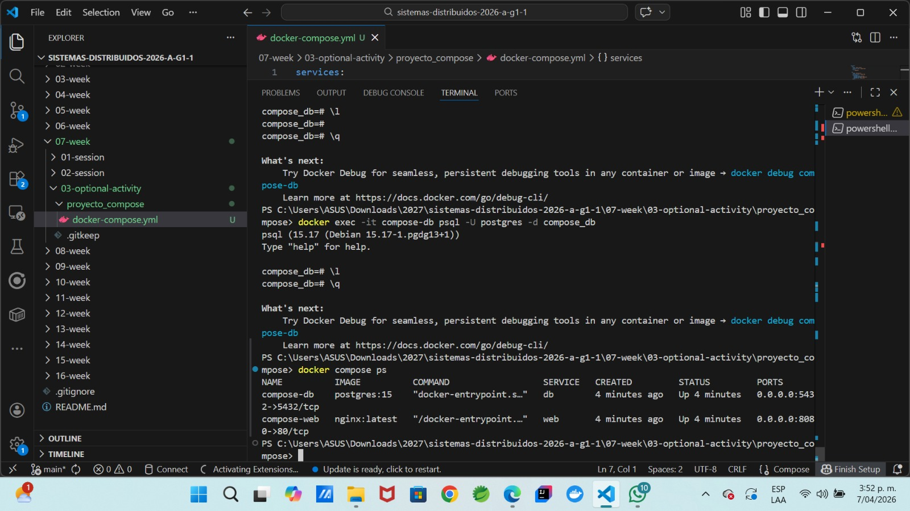
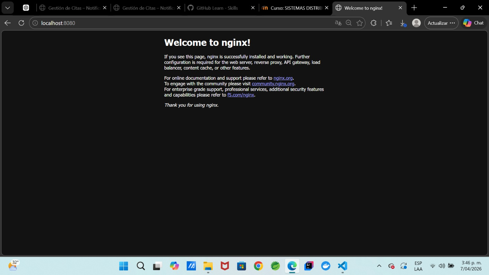
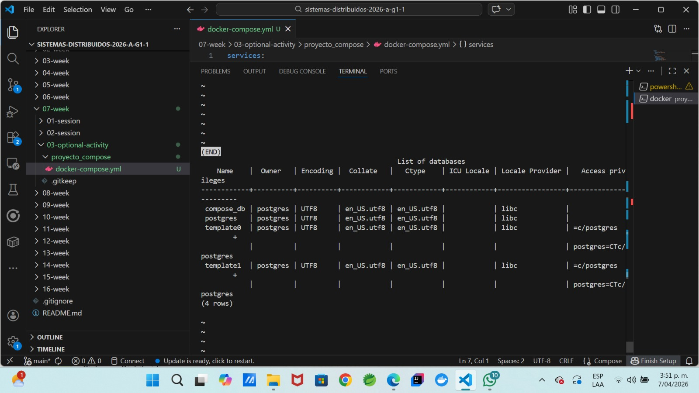

# Week 7 – Docker Compose: Entorno Multicontenedor

## Objetivo

Implementar un entorno multicontenedor utilizando **Docker Compose**, donde se ejecutan dos servicios:

* Un servidor web con **Nginx**
* Una base de datos con **PostgreSQL**

Además, se verifica la persistencia de datos mediante volúmenes y la correcta comunicación entre servicios.

---

# 1. Creación del archivo docker-compose.yml

Se creó un archivo llamado:

```text
docker-compose.yml
```

Dentro de la carpeta:

```text
07-week/03-optional-activity/proyecto_compose
```

---

# 2. Definición de los servicios

Se definieron dos servicios:

* **web** → nginx
* **db** → postgres

```yaml
services:

  web:
    image: nginx:latest
    container_name: compose-web
    ports:
      - "8080:80"

  db:
    image: postgres:15
    container_name: compose-db
    environment:
      POSTGRES_DB: compose_db
      POSTGRES_USER: postgres
      POSTGRES_PASSWORD: postgres
    volumes:
      - db_data:/var/lib/postgresql/data

volumes:
  db_data:
```

---

# 3. Ejecución de los contenedores

Se ejecutó el siguiente comando para iniciar los servicios:

```bash
docker compose up -d
```

Este comando:

* Descargó las imágenes necesarias
* Creó los contenedores
* Inició los servicios en segundo plano

---

# 4. Verificación de contenedores en ejecución

Se utilizó el siguiente comando:

```bash
docker compose ps
```

Este comando permitió verificar que los servicios estaban activos.

## Evidencia



---

# 5. Verificación del servidor web (Nginx)

Se accedió al navegador utilizando:

```text
http://localhost:8080
```

Se confirmó que el servidor web estaba funcionando correctamente.

## Evidencia



---

# 6. Acceso al contenedor de la base de datos

Se ejecutó el siguiente comando:

```bash
docker exec -it compose-db psql -U postgres -d compose_db
```

Esto permitió ingresar al cliente de PostgreSQL dentro del contenedor.

---

# 7. Verificación de la base de datos creada

Dentro de PostgreSQL se ejecutó:

```sql
\l
```

Este comando mostró la lista de bases de datos disponibles.

Se confirmó la existencia de:

```text
compose_db
```

## Evidencia




---

# 8. Persistencia de datos

Se utilizó un volumen llamado:

```text
db_data
```

Este volumen permite que los datos de PostgreSQL se mantengan incluso si el contenedor se elimina.

---

# 9. Detención de los servicios

Se utilizó el siguiente comando:

```bash
docker compose down
```

Este comando detuvo y eliminó los contenedores.

---

# 10. Conclusión

Se implementó correctamente un entorno multicontenedor utilizando Docker Compose, integrando un servidor web y una base de datos.
Se verificó el funcionamiento de ambos servicios y la persistencia de los datos mediante volúmenes.

Docker Compose facilita la administración de múltiples contenedores y permite definir toda la infraestructura en un solo archivo.

---

# Estructura del proyecto

```text
07-week
 └── 03-optional-activity
      └── proyecto_compose
           ├── docker-compose.yml
           └── images
                ├── docker-compose-ps.png
                ├── nginx-browser.png
                └── postgres-database.png
```

---

# Comandos utilizados

```bash
docker compose up -d

docker compose ps

docker exec -it compose-db psql -U postgres -d compose_db

docker compose down
```
